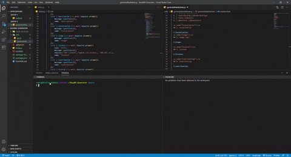
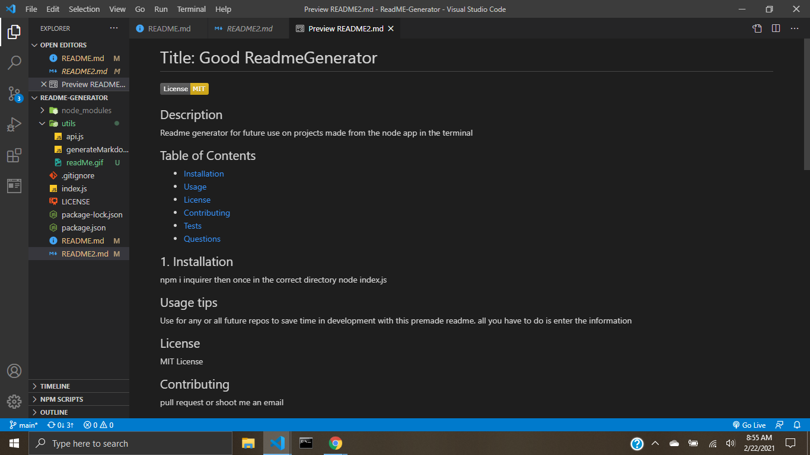

<div align="center">

# ReadME-Generator

Built with Node.js

URL of the GitHub repository: https://github.com/TomFallon9/ReadMe-Generator

</div>

## Table of Contents 

* [Description](#description)

* [Installation](#installation)
* [Usage](#usage)
* [Built With](#built-with)
* [Credits](#credits)
* [License](#license)

## Description

When creating an open source project on GitHub, it is important to have a quality README with information about the app--what is the app for, how to use the app, how to install it, how to report issues, and how to make contributions so that other developers are more likely to use and contribute to the success of the project.

This command-line application is for developers who need to easily put together a good README for a new project. This application dynamically generates a README.md from a user's input. This makes the development process a bit easier while finalizing a project


## Installation

The user must have Node installed. To install necessary dependencies  (inquirer), run the following command:

npm i
```


## Usage

The application will be invoked with the following command:

```
node index.js
```
The user will be asked for their GitHub username, which will be used to make a call to the GitHub API to retrieve their email and profile image. They will then be prompted with questions about their project.
The name of the new readme will be "readme2.md" and be populated with the following:

* Project title
* License badge
* Table of Contents
* Description
* Installation
* Usage
* Tests
* Contributing
* Questions
  * User GitHub profile picture
  * User GitHub email
 
* License

This GIF demonstrates the app functionality.



The command line from the GIF made this [README](https://github.com/TomFallon9/ReadMe-Generator/blob/main/README2.md).




## Built With

* [Node.js](https://nodejs.org/en/) - An open-source JavaScript runtime environment that executes JavaScript outside of the browser. 


## Credits


Starting files from © 2019 Trilogy Education Services, a 2U, Inc. brand. All Rights Reserved.


## License

Copyright 2021 Thomas Fallon

Licensed under the [MIT License](https://opensource.org/licenses/MIT)
